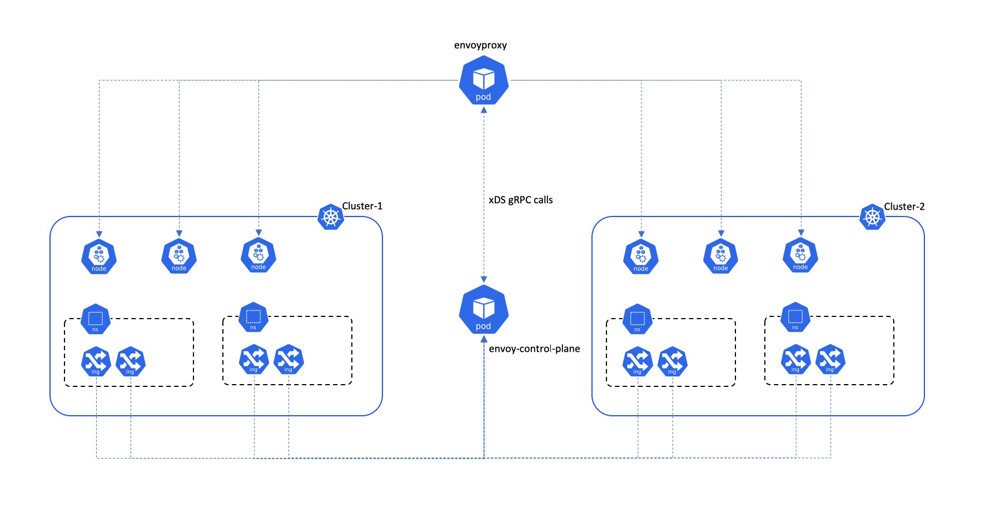
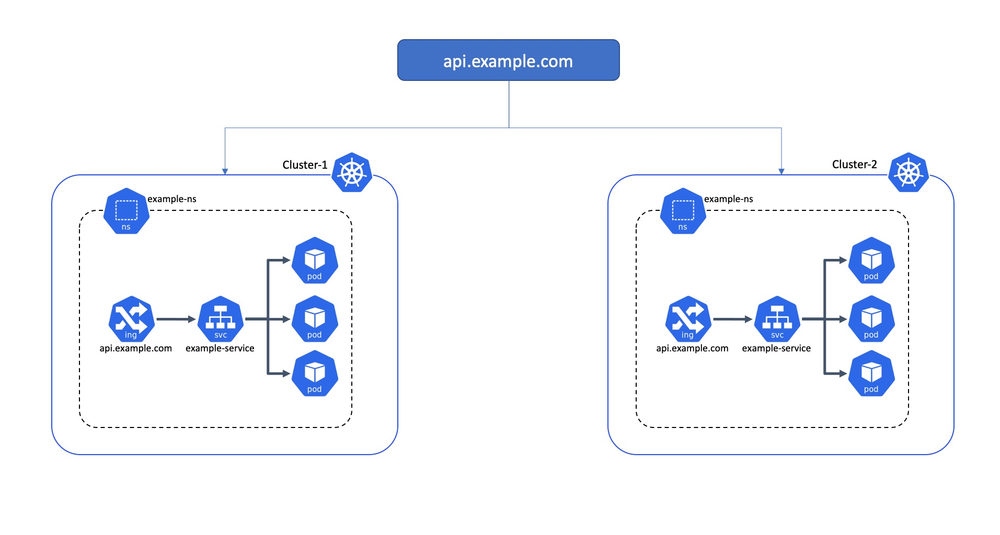

# envoy-control-plane

Multi cluster Ingress controller implementation using envoyproxy

* [Overview](#overview)
    * [Multi-cluster ingress](#multi-cluster-ingress)
    * [Cross Region Failover](#cross-region-failover)
* [Annotations](#annotations)
  

## Overview

Watches Ingress objects from multiple kubernetes clusters and forms a single upstream `cluster` in envoy.

### Multi-cluster ingress
    
For each Service you are planning to use in the multi-cluster ingress, it must be configured the same across all of the clusters.

* Have the same ingress host name in all of the clusters.
* Have the same service name in all of the clusters.
* Be in the same namespace in all of the clusters.
* Be of type NodePort.

### Cross Region Failover

When clusters from different regions are added, envoy `endpoints` will have k8s worker nodes from both the regions, with highest priority to the region in which envoy is running. If the pods fail in that region it will fall back to other region. Here's a doc on how envoy priority works - https://www.envoyproxy.io/docs/envoy/latest/intro/arch_overview/load_balancing/priority#priority-levels  

## Annotations

The following annotations are supported:

|Name|Default|Usage|
|---|---|:---:|
|[`thresholds.circuitbreakers.cluster.envoyproxy.io/max-connections`]()|1024|[docs](https://www.envoyproxy.io/docs/envoy/latest/api-v2/api/v2/cluster/circuit_breaker.proto#cluster-circuitbreakers-thresholds)|
|[`thresholds.circuitbreakers.cluster.envoyproxy.io/max-pending-requests`]()|1024|[docs](https://www.envoyproxy.io/docs/envoy/latest/api-v2/api/v2/cluster/circuit_breaker.proto#cluster-circuitbreakers-thresholds)|
|[`thresholds.circuitbreakers.cluster.envoyproxy.io/max-requests`]()|1024|[docs](https://www.envoyproxy.io/docs/envoy/latest/api-v2/api/v2/cluster/circuit_breaker.proto#cluster-circuitbreakers-thresholds)|
|[`thresholds.circuitbreakers.cluster.envoyproxy.io/max-retries`]()|3|[docs](https://www.envoyproxy.io/docs/envoy/latest/api-v2/api/v2/cluster/circuit_breaker.proto#cluster-circuitbreakers-thresholds)|

